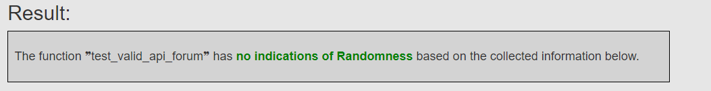
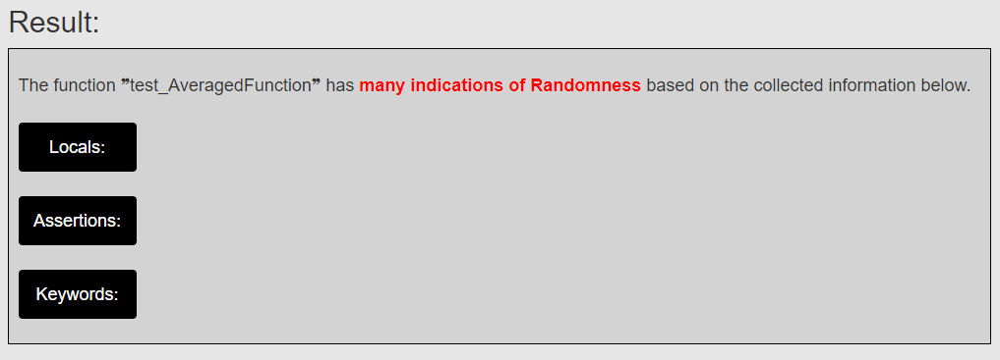
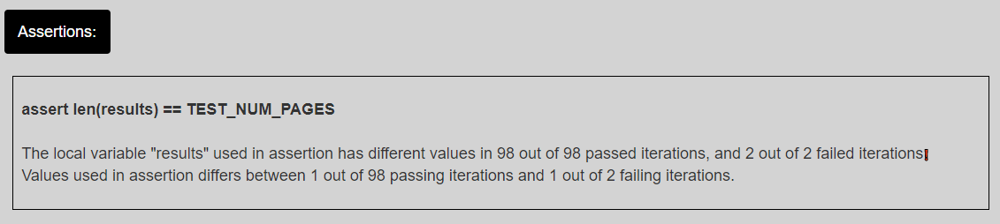
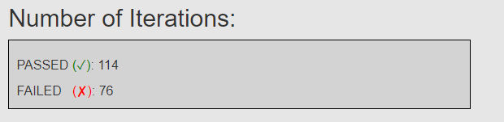

# FlakyReporter

A package used for re-running known flaky tests and producing a report on if they could be flaky due to Randomness.

When run, will rerun any specified pytest and trace any specified function and finish with creating a .html report on the findings made.

The [example](example) folder contains information about doing a test run on already created log files as an example on how to run the tool.

Note
 - This only works on the pytest framework.
 - Assumes that the target test is confirmed flaky.
 - Require the user to perform some manual tasks, specified in __IMPORTANT USAGE__.
 - Only specifies how likely it thinks the flakiness is due to Randomness and may provide false negatives/positives.
 - Example of trace logs are locate in the *example* folder.

## Installation
Navigate to the *FlakyReporter* folder.
run the command ```pip install pytest-trace/``` and then run the command ```pip install .```.

## Usage

__READ IMPORTANT USAGE BEFORE RUNNING THE APPLICATION__

When both ```pytest-trace``` and ```flakyreporter``` are installed the program can be used as a python3 package.

The most common type of command to execute is:<br/>
```python3 -m flakyreporter -i 100 -f ./someproject/tests/test.py -t test_testFunctionName```<br/>
This command will run the file ```test.py``` 100 times and trace the execution of ```test_testFunctionName``` and then produce a report for it.

If you already have valid log files stored, you can scan them directly by running:<br/>
```python3 -m flakyreporter --scan -t test_testFunctionName```<br/>
which will scan the trace logs from the ```test_testFunctionName``` function and produce a report on the findings made.

## __IMPORTANT USAGE__

The ```pytest.ini``` file must be located inside the target project folder and the ```__pycache__``` folder created from the tests run must be removed before the FlakyReporter will fully work.

If any ```pytest.ini``` file already exists, add the line: *enable_assertion_pass_hook=true* below the *[pytest]* section.

## Flags

| Flag                | Description                                                                                                                                                                                                                                                                                                                                                                                                                                            | Usage                      |
|---------------------|--------------------------------------------------------------------------------------------------------------------------------------------------------------------------------------------------------------------------------------------------------------------------------------------------------------------------------------------------------------------------------------------------------------------------------------------------------|----------------------------|
| --scan              | Scans the trace logs with the given name by the -t flag                                                                                                                                                                                                                                                                                                                                                                                                | ```--scan```               |
| -t<br/>--target     | Sets the target(s) to be traced or scanned.<br/> Must include at minimum 1 argument.<br/> Can include more than one test as described in usage.                                                                                                                                                                                                                                                                                                        | ```-t test_a test_b ...``` |
| --reset             | If this flag is set it will delete the ```tracelogs/``` folder and all its content.                                                                                                                                                                                                                                                                                                                                                                    | ```--reset```              |
| -i<br/>--iterations   | Sets the number of iterations to rerun the target file for scanning.                                                                                                                                                                                                                                                                                                                                                                                   | ```-i 100```               |
| -f<br/>--file       | Specifies the target folder or file where either all test files lay or where the target test file is located. <br/>   Can be given ```-f all```as flag and it will run all test files located from the  current working directory.<br/>  If given a test file, such as ```-f tests/test.py``` it will only run the ```test.py``` file. <br/>  If given a folder, such as ```-f tests```it will run the entire test suite located in the ```tests/``` folder.<br/> | ```-f tests/test.py```     |

## HTML Report

The created .html report contains information about found indicators of randomness, a result of how likely it thinks that the flakiness is due to Randomness. The report serves as a guidance more than a "automatic fixer", as the information provided in the report is to help a developer locate and fix the root cause. By reading all indicators found it is possible to scan and get a better understanding of where the problem may manifest.

The *Assertions* and *Keywords* provides the most information about locations and variables that might be causing the test to introduce flakiness due to Randomness.

The *No Result* image represents the output when no randomness is found.<br/>


The *Many Indications* image represents the output when many indicators are found. All buttons present provide some additional information about what information was found when clicked.<br/>


When a button is clicked it expands a new subbox and displays additional useful information. In the image below we identify the variable *results* which is random over all iterations, passing and failing.  We further note that it is used in the final assertion, providing the information that the random variable is causing flakiness due to invalid random outcomes.<br/>


The report also contains META data of the operating system, python version etc., the number of iterations analyzed is also presented in a "passing" to "failing" indicator.<br/>
